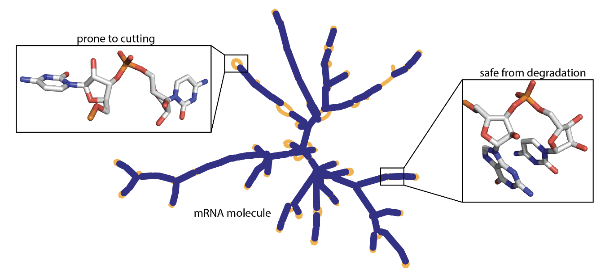

# Deep Learning Model for mRNA Degradation Prediction


*Image Source: [Kaggle Competition](https://www.kaggle.com/competitions/stanford-covid-vaccine/overview)*

**Note: This project is based on a Kaggle competition. All data, resources, and inspiration are drawn from the [Stanford COVID-19 mRNA Vaccine Degradation Prediction](https://www.kaggle.com/competitions/stanford-covid-vaccine/overview) Kaggle competition.**

## Introduction

mRNA vaccines are crucial in combating the COVID-19 pandemic, but they face stability limitations. The instability of messenger RNA (mRNA) molecules restricts their distribution and storage, hindering their global reach. These limitations highlight the importance of designing stable mRNA vaccines to ensure their effectiveness. This project aims to predict mRNA degradation rates to assist scientists and researchers in creating more stable vaccines. The OpenVaccine: COVID-19 mRNA Vaccine Degradation Prediction model is developed using the Eterna dataset, which comprises over 3000 RNA molecules.

## Project Objectives

This repository contains code and resources for designing a deep learning model that predicts mRNA degradation rates at each base of an RNA molecule. The main steps of the project include:

1. **Data Preprocessing**: Exploring and preprocessing sequence, structure, and predicted loop type features from the dataset to prepare them for training.

2. **Model Architecture**: Building a deep learning model using TensorFlow's GRU layers to predict degradation rates. The model architecture includes embedding, spatial dropout, and bidirectional GRU layers.

3. **Training and Evaluation**: Training the model using the training dataset and evaluating its performance using the validation dataset. The primary evaluation metric used is the Mean Column-wise Root Mean Squared Error (MCRMSE).

4. **Predictions**: Making predictions on the public test datasets using the trained model.

5. **Post-processing and Submission**: Combining the predicted results and formatting them for submission.

## Getting Started

### Prerequisites

To run the code in this repository, you'll need the following libraries:

- TensorFlow
- Pandas
- NumPy
- Plotly
- Scikit-Learn

You can install these libraries using the following command:

```bash
> pip install -r requirements.txt
```

All the code steps are avaiable in the [jupyter notebook](mRNA-degradation-prediction.ipynb)

## Results and Conclusion

This project demonstrates the power of deep learning in addressing real-world challenges in the field of bioinformatics. By leveraging the Eterna dataset and drawing inspiration from the Stanford COVID-19 mRNA Vaccine Degradation Prediction Kaggle competition, we've developed a model that predicts mRNA degradation rates. Feel free to explore the code and adapt it for your projects or datasets. The models can be further optimized and customized for improved results.